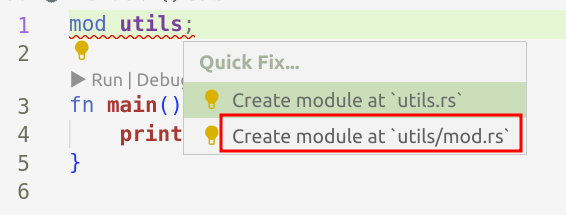

# quick-start-rs 
quick-start-rs（quick start a rust project）是用于快速创建一个 rust 项目的脚手架/模版。

>* 标题：为自己量身打造一个 Rust 项目模板/脚手架
>* 深度参考 [Rust Code Quick Start](https://www.youtube.com/watch?v=oxx7MmN4Ib0)
>* 文章来自 [suhanyujie](https://github.com/suhanyujie/quick-start-rs)
>* Tags: Rust, utils, quick start, project template，脚手架

## 正文
当你心血来潮，想用 Rust 写一个小工具时，也许你可以直接使用 `cargo new pro1001` 之类的命令进行快速创建，但这样你需要做一些前置准备工作，比如：创建 utils crate、错误处理等等。现在也许你可以有更好的方式 —— quick-start-rs，当然，本文只是抛砖引玉，提供一个思路，你完全可以根据自己的需要定制自己的“quick-start-rs”。此外，本文也是参考 [Rust Code Quick Start](https://www.youtube.com/watch?v=oxx7MmN4Ib0) 撰写的。

本文需要你已经了解使用 [VSCode + RA](https://rust-analyzer.github.io/) 进行开发 rust 项目开发。

### 创建项目
当然，从 0 到 1，我们还是使用 `cargo new quit-start-rs` 创建项目，并进入项目目录。

```rust
$ cargo new quit-start-rs
$ cd quit-start-rs

.
├── Cargo.lock
├── Cargo.toml
├── README.md
├── src
│  └── main.rs
└── target
```

### utils crate
写项目时，经常会用到所谓的 utils 工具包，其中可能会无所不包，如字符串处理、加解密，以及一些 helper 方法。有一个快捷方式，直接在 main.rs 顶部加入 `mod utils`：

```rust
mod utils; // <- New

fn main() {
    println!("Hello, world!");
}
```

此时 utils crate 尚未被创建和声明，我们只需将光标放置在报错处，按快捷键 alt + Enter（或者点击小灯泡）：




此时 RA 会帮你创建好对应的目录和文件：

```
.
├── Cargo.lock
├── Cargo.toml
├── README.md
├── src
│  ├── main.rs
│  └── utils        //  <- New
│     └── mod.rs
└── target
```

此时就能直接在 `./src/utils/mod.rs` 文件中编写工具函数。如果还需细分，可以在 `src/utils` 目录下继续创建文件或目录，用于更详细的模块划分。

### 错误处理
用 Rust 编写工具或项目时，错误处理是不可缺少的东西，随着项目的增加，引入其他第三方 crate，或有各种各样的错误类型，为了在你的项目中统一这些错误，我们可以用到 [thiserror](https://crates.io/crates/thiserror)。所以我们可以将其加入的项目模版中：

```toml
[dependencies]
thiserror = "1"
```

在 main.rs 文件顶部，增加 `mod errors;`，然后根据“灯泡”提示，直接创建文件：

```
.
├── Cargo.lock
├── Cargo.toml
├── README.md
├── src
│  ├── errors.rs  // <- New
│  ├── main.rs
│  └── utils
│     └── mod.rs
└── target
```

然后在其中声明你自己项目的错误类型：

```rust
#[derive(thiserror::Error, Debug)]
pub enum Error {
    #[error("Generic {0}")]
    Generic(String),

    // // 例如将标准库中的 io error 统一为你定义的错误类型。以此类推，你可以将其他库中的错误统一为你声明的错误类型。
    #[error(transparent)]
    IO(#[from] std::io::Error), 
}
```

### prelude
每个项目中都可以根据需要定制化地加入要引入的定义或者库，我们可以将这种预引入独立到一个文件中 prelude.rs。还是一样的方法，在 main.rs 文件顶部，增加 `mod prelude;`，然后根据“灯泡”提示，直接创建文件：

```
.
├── Cargo.lock
├── Cargo.toml
├── README.md
├── src
│  ├── errors.rs 
│  ├── main.rs  
│  ├── prelude.rs   // <- New
│  └── utils
│     └── mod.rs
└── target
```

可以在文件中加入需要的“预引入”，比如常用的 Result 别名定义：

```rust
// prelude.rs
use crate::errors::Error;

pub type Result<T> = std::result::Result<T, Error>;
```

这样，整个项目中，在需要返回 Result 类型时，直接在函数签名中定义如下的返回值即可（记得要引入 prelude `use crate::prelude::*;`）：

```rust
use crate::prelude::*;

pub fn lib1() -> Result<String> {
    Ok("lib1 is called...".into())
}
```

### New Type 模式
New Type 在 Rust 中是一种[惯用法](https://doc.rust-lang.org/rust-by-example/generics/new_types.html#new-type-idiom)，可以将一个类型进行包装。使用它的意义可以参考 [Rust 语言圣经](https://course.rs/advance/into-types/custom-type.html#newtype)中：
* 为外部类型实现 trait
* 更好的可读性
* 隐藏内部细节

基于此，我们可以为该项目实现一个通用的 wrapper 类型，使其在你需要的时候，可以为你所使用：

```rust
// prelude.rs
pub struct W<T>(pub T);
```

#### 示例 —— 读取目录下的文件
为了使用更好的理解，这里使用一个示例，读取指定目录下的文件列表。在一般情况下，我们可以使用如下代码实现：

```rust
/// read file list in some dir
fn get_files_by_dir(dir: String) -> Result<Vec<String>> {
    let mut list = vec![];
    for entry in fs::read_dir(dir)?.filter_map(|item| item.ok()) {
        let entry = entry
            .path()
            .to_str()
            .map(String::from)
            .ok_or_else(|| Error::Generic("Invalid path {entry:?}".into()))?;
        list.push(entry);
    }
    return Ok(list);
}
```

基于 `fs::read_dir()` 的迭代器，迭代的结果是 `DirEntry`，我们需要将其转换为 `String` 类型，我们可以将 DirEntry 用 `W<T>(pub T)` 包装一下，并为 W 类型实现 TryFrom trait:

```rust
// src/utils/dir_entry_from.rs
impl TryFrom<W<&DirEntry>> for String {
    type Error = Error;

    fn try_from(value: W<&DirEntry>) -> Result<String> {
        value
            .0
            .path()
            .to_str()
            .map(String::from)
            .ok_or_else(|| Error::Generic(format!("Invalid path: {:?}", value.0)))
    }
}
```

此时，`get_files_by_dir` 函数的实现就会简单干净很多：

```rust
fn get_files_by_dir(dir: String) -> Result<Vec<String>> {
    let mut list = vec![];
    for entry in fs::read_dir(dir)?.filter_map(|item| item.ok()) {
        let entry: String = W(&entry).try_into()?;
        list.push(entry);
    }
    return Ok(list);
}
```

此时可能会有同学问，为啥不直接为 DirEntry 实现 TryFrom trait，而非要用 W 类型包装一下？

主要原因是 Rust 中存在一种[“孤儿规则”（orphan rule）](https://doc.rust-lang.org/book/ch19-03-advanced-traits.html?highlight=orphan%20rule#using-the-newtype-pattern-to-implement-external-traits-on-external-types)导致，因为它，我们不能为非本地类型实现非本地的 trait，在这里，DirEntry 是标准库中的类型，TryFrom 也是标准库中的 trait，因此我们需要将 DirEntry 包装成一种新的本地类型 —— 即用 `W<pub T>` 对其进行包装，从而实现 TryFrom trait。

## cargo generate
完成以上步骤后，你的项目模板基本成形，此时可以提交到 Github，然后基于这个仓库进行新项目的创建。如果还没有安装，可以使用 `cargo install cargo-generate` 进行安装。

安装完成后，可以使用命令：`cargo generate --git https://github.com/suhanyujie/quick-start-rs.git` 进行拉取。

cargo-generate 默认是从 Github 上拉去仓库模板的，因此可以使用简短一点的方式：

```shell
cargo generate suhanyujie/quick-start-rs
```

然后按照命令行的提示，输入新**项目名**称即可生成（例如这里我输入的项目名是 demo1）：

```
$  cargo generate suhanyujie/quick-start-rs
⚠️   Favorite `suhanyujie/quick-start-rs` not found in config, using it as a git repository: https://github.com/suhanyujie/quick-start-rs.git
🤷   Project Name: demo1
🔧   Destination: /some/path/xxx/demo1 ...
🔧   project-name: demo1 ...
🔧   Generating template ...
[ 1/15]   Done: .gitignore
[ 2/15]   Done: Cargo.lock
[ 3/15]   Done: Cargo.toml
[ 4/15]   Done: README.md
[ 7/15]   Done: docs/images
[ 8/15]   Done: docs
[ 9/15]   Done: src/errors.rs
[10/15]   Done: src/main.rs
[11/15]   Done: src/prelude.rs
[12/15]   Done: src/utils/dir_entry_from.rs
[13/15]   Done: src/utils/mod.rs
[14/15]   Done: src/utils
[15/15]   Done: src
🔧   Moving generated files into: `/some/path/xxx/demo1`...
💡   Initializing a fresh Git repository
✨   Done! New project created /some/path/xxx/demo1
```

实际上 cargo generate 功能很多，更详细的用法和配置可以参考[官方仓库](https://github.com/cargo-generate/cargo-generate)和[文档](https://cargo-generate.github.io/cargo-generate/)。

## 结语
好了到这里，我们的项目脚手架的搭建和使用基本完成，我们向其中添加了一些基本的错误定义，工具库，以及预引入功能，可以让你在写从 0 到 1 的项目时，更快地聚焦于项目本身的逻辑，提高效率。如果你觉得有更好的方式方法，欢迎在 [issues 中](https://github.com/suhanyujie/article-transfer-rs/issues)提问题交流 : )。

## 参考
* 关于基于模板创建新项目可以参考 https://rust-github.github.io/
* [Rust Code Quick Start](https://www.youtube.com/watch?v=oxx7MmN4Ib0)
* [cargo generate](https://github.com/cargo-generate/cargo-generate) 
